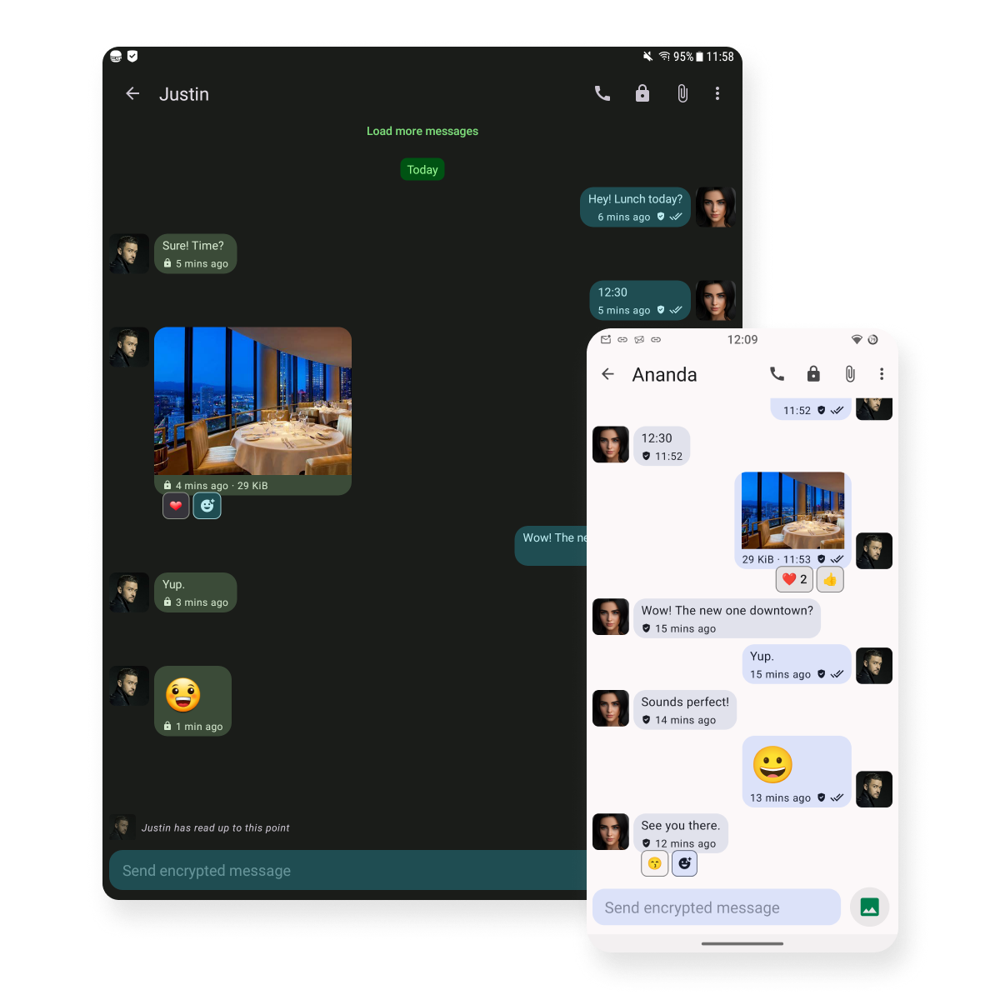

---
hide:
  - navigation
  - toc
---

#

<figure markdown>
  { width=85% }
  { width=85% }
</figure>

{ width=60%}

## Communication that simply works

Connect with family, friends, loved ones, and colleagues. Enjoy free, privacy-friendly communication with no telemetry, unnecessary conditions, or compromises on security. Make high-quality voice and video calls. Register without the need to provide personal data. Compatible with various devices and operating systems. A decentralized service based in Switzerland :flag_ch:, accessible from anywhere in the world :earth_africa:.

[Documentation](https://docs.chatrix.one/en){ .md-button .md-button--primary } [Learn more](http://chatrix.one/#everything-you-would-expect){ .md-button .md-button }

{ width=20%}

<figure markdown>
  { width=80%}
</figure>

{ width=20%}

## Everything you would expect

-   :fontawesome-solid-paper-plane:{ .lg .middle } __Instant messaging__

    ---

    Markers for sent :material-check:, received :material-check-all: and read :material-check-all:{: .green} message. Ability to edit messages :material-pencil:.  Support for emoticons and reactions :smiling_face_with_3_hearts:. You can see how far the chat participants have read. Group chats, also known as rooms.

-   :material-lock:{ .lg .middle } __OMEMO Encryption__

    ---

    An end-to-end encryption mechanism that ensures all communication remains between the participants, whether you're sending messages or sharing a file. 

    [:octicons-arrow-right-24: Learn more](https://en.wikipedia.org/wiki/OMEMO)

-   :simple-adblock:{ .lg .middle } __No Adds and No Telemetry__

    ---

    Communicate without telemetry, analytics, countless banners and unwanted advertising messages, as well as offers to install unnecessary applications.

    [:octicons-arrow-right-24: Donate](https://docs.chatrix.one/en/faq/?h=finan#will-the-service-be-available-after-x-years)

-   :material-video:{ .lg .middle } __Audio and Video Calls__

    ---

    Enjoy high-quality audio and video calls that connect you with the people who matter. Anytime, anywhere. Share moments, ideas, and solutions. 

-   :material-image:{ .lg .middle } __Files__ 

    ---

    Share photos, documents and files of any format effortlessly, quickly and conveniently. Whether you are at work or at home, exchanging information is easy and secure!

-   :fontawesome-solid-location-dot:{ .lg .middle } __Locations__

    ---

    Share locations and make meeting and traveling easier. No matter where you are, the recipient will know exactly where you are without you having to explain.

{ width=20%}

<figure markdown>
  { width=80%}
</figure>

{ width=20%}

## Download

-   :simple-android:{ .lg .middle } __Android__

    ---

    **Conversations** is a Jabber/XMPP client for smartphones running Android 5.0+ that is optimized to provide a unique mobile experience.

    [:simple-fdroid: Download from F-Droid](https://f-droid.org/packages/eu.siacs.conversations/)
    
    [:material-google-play: Buy from Google Play](https://play.google.com/store/apps/details?id=eu.siacs.conversations)

-   :simple-apple:{ .lg .middle } __iOS__

    ---

    **Monal-IM**. Privacy like in 1999. Preferred client for the platform, just like the Conversations IM APP is for the Android ecosystem. 

    [:fontawesome-brands-app-store-ios: Download from App Store](https://apps.apple.com/us/app/monal-xmpp-chat/id317711500)

-   :material-microsoft-windows:{ .lg .middle } __Windows__

    ---

    **Gajim** - a full-fledged desktop communication client. It is actively being developed. It supports all new technologies offered by the XMPP protocol.

    [:material-download: Download](https://gajim.org/download/)

-   :simple-apple:{ .lg .middle } __MacOS__

    ---

    **Gajim** - a full-fledged desktop communication client. It is actively being developed. It supports all new technologies offered by the XMPP protocol.

    [:fontawesome-brands-gitlab: Instructions](https://dev.gajim.org/gajim/gajim/-/wikis/help/Gajim-on-macOS) 

-   :fontawesome-brands-firefox-browser:{ .lg .middle } __Web Browser__

    ---

    **ConverseJS** - In cases where you do not have the ability to install an application, but you have a web browser and Internet access. 

    [:material-rocket-launch: Launch](https://conversejs.org/fullscreen.html)

-   :fontawesome-solid-terminal:{ .lg .middle } __CLI__

    ---

    **Profanity** - XMPP client for enthusiasts! Works in terminal mode. Available for almost every operating system. 

    [:material-download: Download](https://profanity-im.github.io/)

{ width=20%}

<figure markdown>
  { width=80%}
</figure>

{ width=20%}

## Know Before You Go

-   :material-account-cog:{ .lg .middle } __Account Management__

    ---

    Register for a new account, update your password, or completely remove your account with simple, straightforward steps. Removing your account will also erase all your data, ensuring your privacy is fully protected.

    [:octicons-arrow-right-24: Manage](https://docs.chatrix.one/en/account/registration/)

-   :octicons-question-16:{ .lg .middle } __FAQ__

    ---

    Find answers to 80+ common questions and get quick solutions to common issues you may encounter. Our powerful search feature makes it easy to find exactly what you're looking for.

    [:octicons-arrow-right-24: Find Answers](https://docs.chatrix.one/en/faq/)

-   :octicons-arrow-switch-16:{ .lg .middle } __Alternatives__
 
    ---

    There are tons of free XMPP servers. If you're unsure Chatrix.One is the right solution for you, this section should help you choose alternative service.

    [:octicons-arrow-right-24: Find Server](https://docs.chatrix.one/en/faq/?h=lists#lists-of-free-xmpp-servers)

-   :material-eye-off-outline:{ .lg .middle } __Privacy__

    ---

    As an operator of a service that represents an alternative to the available methods of Internet communication, I strive for a minimum of data and the protection of personal data.

    [:octicons-arrow-right-24: Read Carefully](https://docs.chatrix.one/en/privacy/)
    
-   :material-file-document-check-outline:{ .lg .middle } __Terms__

    ---

    I recommend that you familiarize yourself with the rules that every user, moderator or administrator must follow. Chatrix.One is not responsible for the actions of registered users.

    [:octicons-arrow-right-24: Read Carefully](https://docs.chatrix.one/en/terms/)

-   :octicons-alert-16:{: .red .lg .middle} __Incidents__

    ---

    Detailed information about any incidents that have occurred. Users can review the context and impact of incidents, along with any actions taken.

    [:octicons-arrow-right-24: Log](https://docs.chatrix.one/en/status/#information-about-occurred-incidents)

<figure markdown>
  { width=90%}
</figure>

## Technologies behind the service

- :simple-ubuntu: __Ubuntu__ - OS Main server
- :simple-debian: __Debian__ - OS Backup server
- :material-git: __Git__ - Version control
- :simple-xmpp: __XMPP__ - Communication protocol
- :fontawesome-brands-erlang: __EJabberd__ - XMPP communication
- :simple-nginx: __NGINX__ - Web server
- :simple-openssl: __OpenSSL__ - Cryptography
- :material-ansible: __Ansible__ - DevOps automation
- :fontawesome-brands-docker: __Docker__ - Containers

{ width=20%}

<figure markdown>
  { width=40%}
  { width=40%}
</figure>

{ width=20%}

## Status and Contacts

- :octicons-shield-check-16:{ .lg .middle } __Security and Compliance__

    ---
    
     

    * * *
    
    
    

    [:octicons-arrow-right-24: Service Status](https://docs.chatrix.one/en/status/)

-   :fontawesome-regular-address-book:{ .lg .middle } __Contacts__

    ---

    When contacting me via XMPP, do not send a subscription request. Send your message directly, as I do not accept subscription requests from strangers.

    :material-email-edit-outline: admin:simple-maildotru:chatrix.one 
    :simple-xmpp: admin:simple-maildotru:chatrix.one 
    :simple-github: [ChatrixOne](https://github.com/ChatrixOne)

